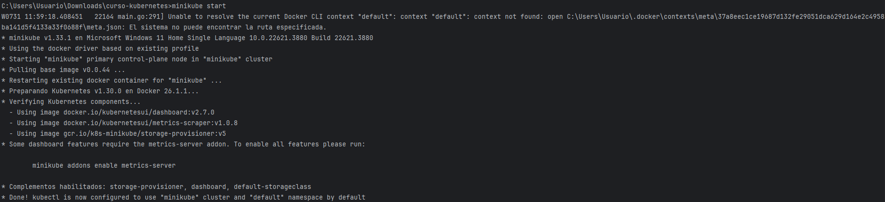
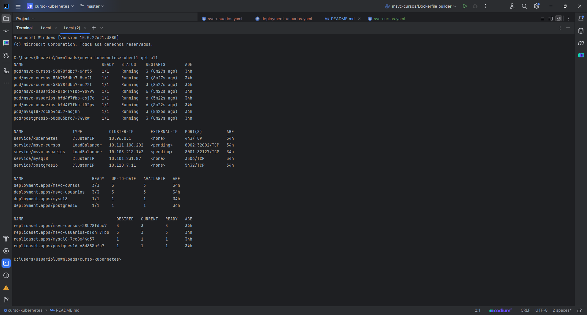
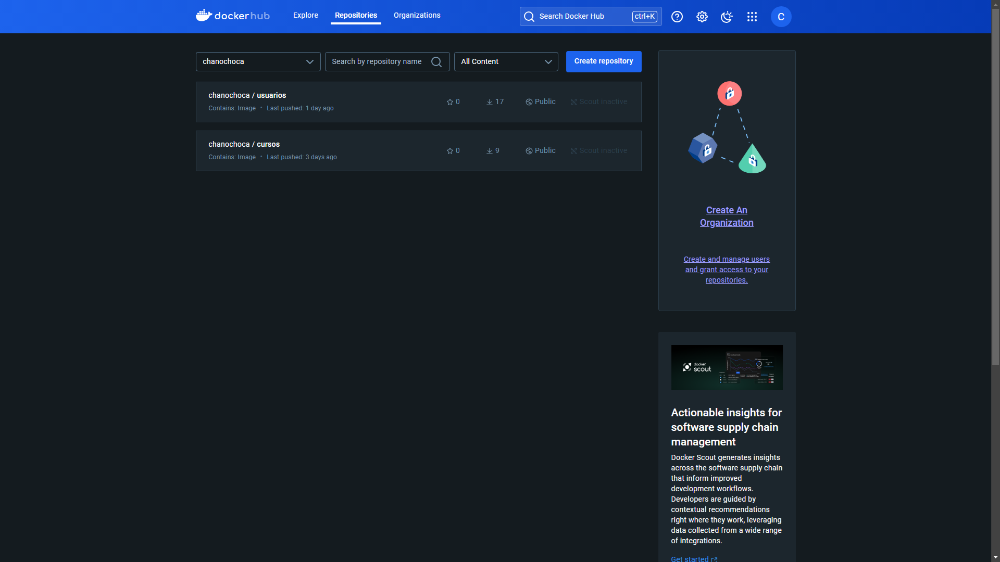
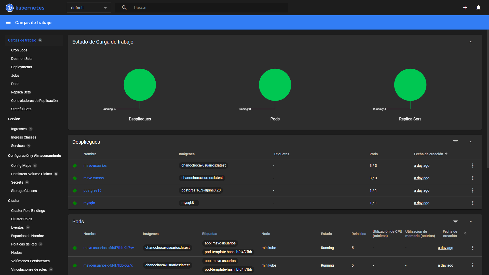

# Spring Boot With Kubernetes

A Spring Boot Proyect, using Postgres (for Courses) and MySQL (for Users), docker to isolate applications in containers and Kubernetes to handle that containers.


## Screenshots










## Tools Used

- Spring Boot
  - DevTools
  - Spring Web (consider use Reactive Web)
  - Spring Data JPA
  - MySQL Driver (for Courses)
  - PostgreSQL Driver (for Students)
  - OpenFeign
  - Validation
- Docker
- Kubernetes (Minikube)


## Environment Variables

To run this project, you will need to modify the application.properties in msvc-usuarios and msvc-cursos. Modify the following elements:

`spring.datasource.password`: Use your datasource password for MySQL and PostgreSQL

`serverTimezone`: Modify this if you are not from Buenos Aires

`server.port`: Modify this only if you have problems with the port

## Nota:
Si quieres emitir endpoints desde Postman, no vas a poder debido a que los svc-cursos y svc-usuarios son de tipo LoadBalancer.
Debes establecer un túnel entre tu maquina local y el puerto de servicio para permitir esto:
``` bash
kubectl port-forward service/msvc-cursos 8002:8002
```
``` bash
kubectl port-forward service/msvc-usuarios 8001:8001
```

## Authors

- [@Juan Ignacio Caprioli (ChanoChoca)](https://github.com/ChanoChoca)

## Badges

[//]: # (Add badges from somewhere like: [shields.io]&#40;https://shields.io/&#41;)

[](https://choosealicense.com/licenses/mit/)

[](https://opensource.org/licenses/)

[](http://www.gnu.org/licenses/agpl-3.0)
